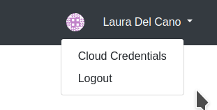
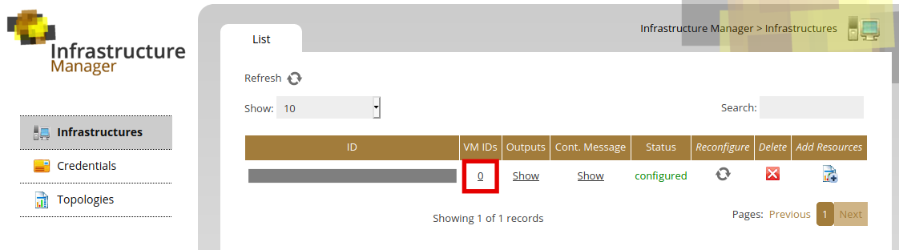
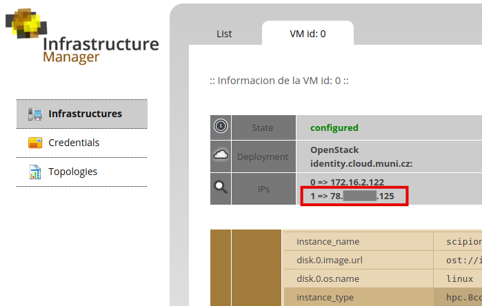

# Scipion-docker

This repo contains all pieces of code needed to deploy an scipion single node or cluster using TOSCA, ansible customization recipes and docker images.

## Deploy Scipion using IM dashboard

This is the production way.
### 1. Go to [IM-dashboard](https://appsgrycap.i3m.upv.es:31443/im-dashboard/login) and log in with your account
### 2. Make sure your account can use cryoem.instruct-eric.eu Virtual Organization
Access can be requested [here](https://aai.egi.eu/registry/co_petitions/start/coef:84).

Go to the credentials menu on the right-upper part of the page and add the sites where you want to deploy. Currently the following VOs support this service: IFCA, CESNET and IISAS FedCloud.



Click on the infrastructure wizard for Scipion and fill up the **Input Values** tab with the desired values:

 * VNC password
 * Master and worker instance types (depending on site)
 * Cryosparc license
 * Public and private network (this is only needed for CESNET site, othewise do not set it)
 * Size of the disk to  be attached to the cluster
 * Number of worker nodes in the cluster (by default none = single node deployment)
 
 On the **Cloud Provider Selection** select the site where you want to deploy the cluster as well as the **Image** (Ubuntu bionic).
  
### 3. Submit your infrastructure

You can check the log to see that everything worked well and once the status be **configured** you can click on the URL given in **Outputs** to access the service.

[Here](https://scipion-em.github.io/docs/docs/developer/scipion-on-the-egi-federated-cloud) you can find documentation on how to use the service.

## Deploy Scipion using IM web

This portal is very similar to the dashboard but TOSCA must be provided explicitly.

### 1. Go to [IM-web](https://appsgrycap.i3m.upv.es:31443/im-web/) and log in with your account
### 2. Make sure you have access to the desired platform
You can open a list your **Credentials** on the left menu.
If necessary, add a new one by clicking the "Add +" button and entering correct information.

### 3. Paste the TOSCA recipe into the new IM topology

Click the **Topologies** button in the left menu and the **Add +** button at the top.

Paste the TOSCA recipe from the **im-topology.yml** file and save the topology.

**Please change default input values:**
 
 * VNC password
 * Master and worker instance types (depending on site)
 * Cryosparc license
 * Public and private network (this is only needed for CESNET site, othewise do not set it)
 * Size of the disk to  be attached to the cluster
 * Number of worker nodes in the cluster (by default none = single node deployment)

**Also change image in the os property for lrms_server and lrms_wn sections.**

You can edit the recipe if needed.
More info about the IM: https://imdocs.readthedocs.io/en/latest/intro.html

### 4. Launch your topology

In the list of topologies launch the one you just created.
You will be redirected to the **Infrastructures** section on the page.
Wait for the **configured** status of the topology.
You can check the log to see that everything worked well.

### 5. Connect to the application

Open info about the VM (**VM IDs** link in a table) and copy the public IP address.

Go to the following link:

    https://paste_the_address:5904

Log in using your password and enjoy working with the Scipion.




## Prepare and run Master node manually
### Prerequisites (ubuntu packages)
* nvidia drivers
* docker with nVidia runtime
* X11 server running
* **xserver-xorg xdm xauth nvidia-container-toolkit nvidia-container-runtime nvidia-docker2**

### Headless machines
#### Configure xdm
When running on headless machine (or a machine where nobody is playing FPS games all the time), 
make sure the X server accepts unauthenticated local connections even when a user session is not running. 
E.g., the /etc/X11/xdm/xdm-config file should contain:

    DisplayManager*authorize:       false

However, such settings can be dangerous if the machine is not dedicated for this purpos, check for possible side effects.

#### Configure xorg
<!-- https://virtualgl.org/Documentation/HeadlessNV -->

**1. Run `nvidia-xconfig --query-gpu-info` to obtain the bus ID of the GPU. Example:**

```bash
Number of GPUs: 1

GPU #0:
  Name      : GeForce RTX 2080 SUPER
  UUID      : GPU-4fcfbe08-eee6-df4b-59aa-4c867e089b2f
  PCI BusID : PCI:10:0:0

  Number of Display Devices: 0
```

**2. Create an appropriate xorg.conf file for headless operation:**

```bash
sudo nvidia-xconfig -a --allow-empty-initial-configuration --use-display-device=None \
--virtual=1920x1200 --busid {busid}
```
Replace `{busid}` with the bus ID you obtained in Step 1. Leave out `--use-display-device=None` if the GPU is headless, i.e. if it has no display outputs.

**3. If you are using version 440.xx or later of the nVidia proprietary driver, then edit /etc/X11/xorg.conf and add**

```
Option "HardDPMS" "false"
```
under the Device or Screen section.

### Installation of prerequisites

#### nVidia runtime

**Installation**

https://github.com/NVIDIA/nvidia-docker/wiki/Installation-(Native-GPU-Support)

**Configuration**

You should now have the **nvidia** runtime installed, which is required to run this project.

You can now replace the default docker runtime **runc** by **nvidia** runtime.  
Backup and edit file "**/etc/docker/daemon.json**".
```json
{
    "runtimes": {
        "nvidia": {
            "path": "/usr/bin/nvidia-container-runtime",
            "runtimeArgs": []
        }
    },
    "default-runtime": "nvidia"
}
```


https://github.com/NVIDIA/nvidia-docker/wiki/Advanced-topics#default-runtime

If you need **runc** as a default runtime for some purpose, do not change this runtime.
Note that you will now need to start the docker image with "**--runtime=nvidia**".

### Run the master container (or single node)

#### Re-pull the image before running the container
```bash
docker pull ldelcano/scipion-master:slurm
```
#### Run

```
docker run -d --name=scipionmaster --hostname=scipion-master --privileged -p 5904:5904 -e USE_DISPLAY="4" -e ROOT_PASS="ROOTPassword" -e USER_PASS="USERPassword" -e MYVNCPASSWORD="VNCPassword" -e CRYOSPARC_LICENSE="YOURSCRYOSPARCLICENSE" -v /tmp/.X11-unix/X0:/tmp/.X11-unix/X0 ldelcano/scipion-master:slurm
```

Env var "**USE_DISPLAY**" will create new display (e.g. "**:4**").
Please note that you need new one for each instance. Therefore change the "**USE_DISPLAY**" value for each instance.

Only one-digit display number is now supported.

This is also related to the port. Change last digit of the ports "**-p 5904:5904**".

You should also specify the ROOT_PASSWORD, USER_PASSWORD and MYVNCPASSWORD for the docker container as well as a new cryosparc license (there is a default one set up for testing but might give problems if in use in another container).

In addition, if you are using default docker runtime, you have to run the container with "**--runtime=nvidia**" parameter.

### Test the master container

Your instance should be available on the link: "**https://your-adress:5904**".

You should use the MYVNCPASSWORD to login.

To check that nvidia is working fine open terminal a try "**nvidia-smi**" and "**glxgears -info**" commands.
Both should print output containing information about your nVidia graphics card.

## Run a test on the worker container

#### Re-pull the image before running the container
```bash
docker pull ldelcano/scipion-worker:slurm
```

#### Run

```
docker run -d --name=scipionworker --hostname=scipion-wn-1 --privileged -v /home/scipionuser/ScipionUserData:/home/scipionuser/ScipionUserData -u scipionuser ldelcano/scipion-worker:slurm /home/scipionuser/scipion3/scipion3 test gctf.tests.test_protocols_gctf.TestGctf
```
You can map a folder on the host to the ScipionUserData folder in the container to verify the test or you could simple check the container's log.

This example is runing a Gctf test but you could of course run the test you want.

<!--
## Troubleshooting

If the commands described above print output that do not contains information about nVidia card, try to backup and delete file "**/etc/X11/xorg.conf**".
-->
